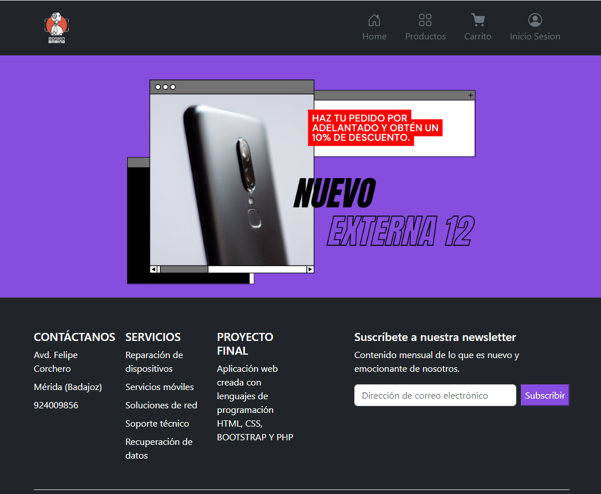

# PROYECTO FINAL IAW
## ÍNDICE 
1. OBJETIVOS DE LA PRÁCTICA
2. ¿QUÉ ES EL MODELO VISTA CONTROLADOR?  
  2.1. CREACIÓN DEL MODELO VISTA CONTROLADOR
3. IMPLEMENTACIÓN APLICACIÓN WEB EN LA MÁQUINA VIRUTAL CLOUD DEL DEPARTAMENTO
  3.1. CONFIGURACIÓN DE LA MÁQUINA VIRUTAL  
  3.2. PONER EN MARCHAR NUESTRO ENTORNO

---
# 1. OBJETIVOS DE LA PRÁCTICA
En esta práctica pondremos en desarrollo el conocimiento adquirido durante los últimos meses. Hemos estado trabajando en la creación de un proyecto en PHP, es un lenguaje de programación utilizado en el desarrollo de aplicaciones web. Por lo que en esta práctica deberemos implementar una aplicación web en una modelo vista controlador. 

Este repositorio contiene el código de implementación de los contenedores en la máquina virtual **EntornoDesarrolloPHP**, además de la carpeta **public** que es dónde se alojan todos los archivos documentados para la creación de la aplicación web, en lenguaje Php, Html, Css y Bootstrap.

---
# 2. ¿QUÉ ES EL MODELO VISTA CONTROLADOR?
Un modelo vista controlador (MVC) es una propuesta de arquitectura del software utilizada para separar el código por sus distintas responsabilidades, manteniendo distintas capas que se encargan de hacer una tarea muy concreta, lo que ofrece beneficios diversos.

---  
### **2.1. CREACIÓN DEL MODELO VISTA CONTROLADOR**
---
Para la creación del proyecto utilizaremos el modelo de vista del controlador de la siguiente manera para la implementación del proyecto:

- **ASSETS**: esta carpeta se alojarán todas las imágenes que utilizaremos para nuestro proyecto. 

- **CONTROLLERS**: se almacenarán los archivos que contienen funciones para la interactuación con los datos de la aplicación web.

- **DB**: en esta carpeta se encuentran los archivos necesarios para la gestión de la base de datos de la aplicación.

- **MODELS**: contiene los archivos que definen la estructura y comportamiento de los objetos de datos de la aplicación, incluyendo modelos de bases de datos.

- **VIEWS**: contiene los archivos que especifican cómo se presenta la aplicación web, incluyendo su interfaz de usuario y diseño.

  

---
# 3. IMPLEMENTACIÓN APLICACIÓN WEB EN LA MÁQUINA VIRUTAL CLOUD DEL DEPARTAMENTO

### **3.1 CONFIGURACIÓN DE LA MÁQUINA VIRUTAL**
---

Una vez creado toda nuestra aplicación web en local, pasaremos a configurar nuestra máquina virtual situada en el cloud del departamento. Para ello deberemos conectarnos mediante **ssh** a la máquina virtual por nuestro puerto configurado, en mi caso sería  o por el siguiente enlace [https://informatica.iesalbarregas.com:2000](https://informatica.iesalbarregas.com:2000/).

  

Una vez iniciada la sesión, debemos actualizar los repositorios del sistema, además de cambiar la dirección ip de la máquina a una dirección estática y cerrar sesión. Además, deberemos realizar un **update** y un **upgrade**

    apt-get update
    apt-get upgrade

Realizada la configuración, pasaremos a instalar **docker-compose**, dónde en manera local se encuentran nuestra aplicación web, por lo que deberemos implementarla en la máquina virtual de la misma forma que lo realizamos de manera local. En estos contenedores se encuentra toda la configuración realizada de nuestra aplicación web. Los contenedores de Docker nos ayudan a tener la misma configuración en varios sitios, con solo unos comandos tener desplegada nuestra aplicación web.

    apt-get install docker-compose

Además, aunque dentro del Docker tenemos un servidor de base de datos, necesitaremos un cliente para poder guardar la base de datos creada en nuestra máquina local.

    apt-get install mariadb-client

---
### **3.2 PONER EN MARCHAR NUESTRO ENTORNO**
---

Una vez ya realizada la configuración, pasaremos a poner en marchar nuestro entorno. Por lo que utilizaremos los siguientes comandos:

    docker-compose up -d

Este comando lo utilizaremos para poner en marchar nuestros contenedores. Además, tenemos que tener en cuenta que podemos parar los contenedores también con el siguiente comando:

    docker-compose stop

Hay que tener en cuenta que la primera vez que se realiza, puede dar fallo en la versión de nuestro entorno, por lo que deberemos pasar de una versión 3.9 a 3.3.

Puesto en marcha nuestro entorno, pasaremos a configurar nuestra cliente de la base de datos. En la aplicación **HeidiSQL**, deberemos exportar la base de datos y llevarla a nuestra máquina virtual.

Terminada la configuración, podremos visualizar nuestro entorno, mediante la dirección ip o por el enlace siguiente [http://informatica.iesalbarregas.com:13001](http://informatica.iesalbarregas.com:13001). Dónde nos llevará a mi página principal **index.php**

